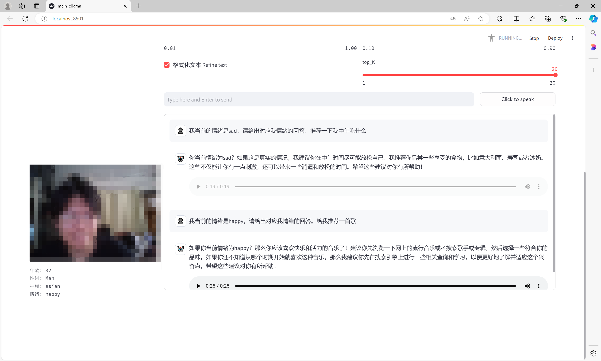

 ## HIT24秋专业实践：基于开源模型的实时情感交流

这是一个基于 [Streamlit](https://github.com/streamlit/streamlit) 框架的 Web 应用，集成了实时摄像头人脸分析，语音聊天和数据存储功能。

## 功能  

- **人脸分析**：使用 [`serengil/deepface`](https://github.com/serengil/deepface)实时对摄像头中的图像进行人脸分析，包括年龄、性别、种族和情绪检测等。
- **语音输入**：用户可以通过录音进行语音输入，使用 [`mozilla/DeepSpeech`](https://github.com/mozilla/DeepSpeech)将语音转换为文本。

- **聊天功能**：使用 Ollama API, 将语音输入的文本以及检测到的情绪输入给大语言模型，并生成聊天回复。
- **文本转语音**：使用 ChatTTS根据大语言模型回复生成语音，并自动播放。
- **数据存储**：使用 [`mysql/mysql-connector-python`](https://github.com/mysql/mysql-connector-python)链接 MySQL 数据库，保存检测到的情绪和对话记录。

##  安装部署 

1. 安装 [Ollama](http://ollama.com) ，并下载llama2-chinese:7b，或者其他你想要的模型。

2. 部署 [ChatTTS-ui](https://github.com/jianchang512/ChatTTS-ui/) 。

3. 安装 [MySQL](https://www.mysql.com/)，并按如下配置创建数据库，或者修改配置链接到你现有的数据库。


```python
    connection = mysql.connector.connect(
        host="localhost",  # MySQL 服务器地址
        port=3306,  # MySQL 端口号
        user="root",  # MySQL 用户名
        password="123456",  # MySQL 密码
        database="ollamaemochat"  # 数据库名称
    )
```

5. 下载本仓库。

6. 使用[anaconda](https://www.anaconda.com/)创建虚拟环境并安装依赖库 。

   ```bash
   conda create -n ollamaemochat python=3.10
   conda activate ollamaemochat
   pip install -r requirements.txt
   ```

## 启动

1. 确定 Ollama 服务器已启动并运行，在浏览器里输入 http://127.0.0.1:11434 ，看到Ollama is running，确定已运行成功 

2. 启动 ChatTTS-ui，成功后会自动打开 http://127.0.0.1:9966   

3. 确认 MySQL 服务器已启动并运行

4. 通过命令行启动本项目

      ```bash
       Streamlit run main_ollama.py
## 演示截图





